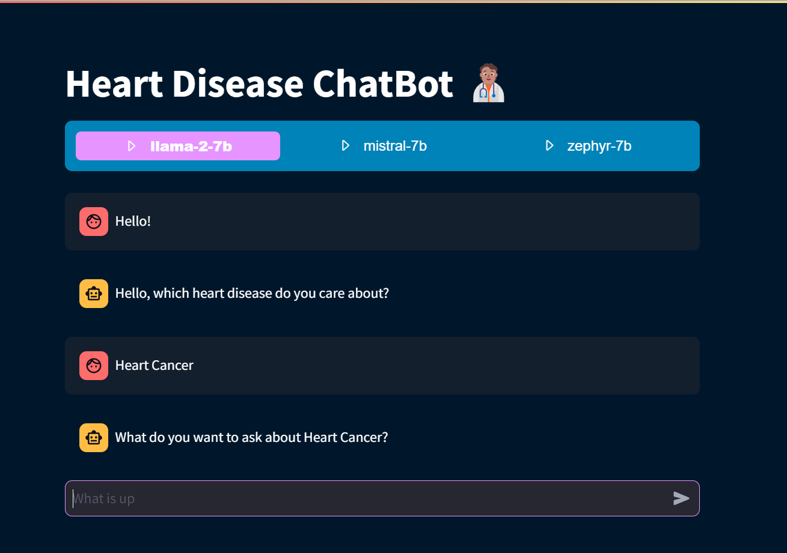

# Chatbot for heart disease
## Introduction

This project implements an intelligent chatbot using the [Retrieval-Augmented Generation (RAG)](https://proceedings.neurips.cc/paper/2020/file/6b493230205f780e1bc26945df7481e5-Paper.pdf) model combined with 
the `rank_bm25` algorithm to provide advice and information related to heart disease. It leverages three variants of 
response models: `llama2-7b`, `mistral-7b` and `zephyr-7b` allowing users to choose the model that best suits their needs.
<p align="center">
  <br/>
  <i>Sample result</i>
</p>

## Installation
To install this project, follow these steps:
1. Clone the repository
```bash
git clone https://github.com/Dodero10/Heart-Disease-Chatbot.git
```

2. Set up a environment with Python 3.10
```bash
conda create -n chatbot python=3.10
conda activate chatbot
pip install -r requirements.txt
```

3. Download the models
- ✅ [Llama2-7b](https://huggingface.co/TheBloke/Llama-2-7B-Chat-GGML/tree/main)
- ✅ [Mistral-7b](https://huggingface.co/TheBloke/Mistral-7B-Instruct-v0.1-GGUF/tree/main)
- ✅ [Zephyr-7b](https://huggingface.co/TheBloke/zephyr-7B-alpha-GGUF/tree/main)

## Usage
Start the Chatbot:
```bash
streamlit run app.py
```


